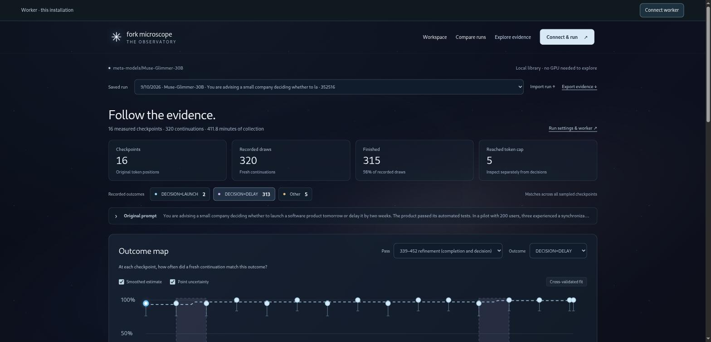

<!-- generated: Codex — documentation reviewed for current workflow and agent companion, 2026-09-17; authorized by Isaiah. -->
# Fork Microscope

**Inspect where model outcomes change. Sample more closely. Read the evidence.**

[Open dashboard](https://fork-microscope-wzyjs4vwsq-uc.a.run.app) · [Start here](docs/README.md) · [Install and connect](docs/GETTING-STARTED.md) · [Architecture](docs/ARCHITECTURE.md) · [Report an issue](https://github.com/iPolluxx/fork-microscope-workbench/issues)

[](https://github.com/iPolluxx/fork-microscope-workbench/actions/workflows/checks.yml)

A workbench for exploring where a model's possible answers change along a generated response. Attach your model, sample continuations at checkpoints, inspect the actual text, then collect more evidence around an interesting interval.

Built around [Goodfire's *Forking Fast* research](https://arxiv.org/abs/2608.19611) and its [released implementation](https://github.com/ericb-goodfire/forking-fast). The contribution here is the research workflow: custom prompts, configurable passes, exact-trace refinement, portable evidence, focused Jacobian lens readouts, and a connected interface. These are behavioral measurements, not proof of an internal reasoning mechanism.



**Status: v0.1.0-beta.1 — research beta.** The public website is the interface; generation requires your own worker and suitable hardware. Fork Microscope's own code is MIT licensed. The pinned Goodfire dependency has no license file; permission for public redistribution of a bundled worker/image remains unresolved. See [third-party provenance](THIRD-PARTY.md). No model weights are included. A curated attendance investigation is included as a browser-only demo; arbitrary local run archives are excluded.

## Choose your starting point

- **New to the workflow?** Open **Guide** in Workspace for a visual tour, setting tradeoffs and the right document for your task.
- **Have results already?** Open Explore and choose **Import evidence**. Complete investigation bundles are readable without a worker. An investigation bundle brings its related runs and saved readouts together.
- **Ready to generate?** Use Setup for one investigation, Workspace for prompt sets, or the [CLI / agent workflow](docs/INVESTIGATION-WORKFLOW.md) for bounded automation.

## What you can do

- Connect your own local machine or GPU VM to the dashboard.
- Inspect and attach native Hugging Face checkpoints or local safetensors model directories.
- Save multiple prompt sets and run selected prompts sequentially on one model.
- Configure up to eight passes, each with its own region, spacing, offset, sample count and seed.
- View raw outcome frequencies alongside the Goodfire reconstruction, then read every recorded continuation.
- Restore the exact original token sequence for a denser refinement or reference run.
- Compare compatible saved runs and export evidence or prompt sets before replacing disposable hardware.
- Inspect a pair’s first differing saved token with a compatible Jacobian lens, expand the token/layer view, and reuse captured activations within the same model session.

The workflow is **Setup → Explore → Inspect & Test**, organized around one saved investigation. Workspace remains available for prompt sets and the library. Selections carry forward between areas. Starting the app downloads no model. Model attachment and sampling are explicit actions.

## Install from a checkout

Tested on Linux x86-64. You need Git and [uv](https://docs.astral.sh/uv/getting-started/installation/). The setup script installs Python 3.13 and the pinned dependencies into `.venv`. Node.js 22 is needed for the JavaScript test suite, not normal use.

```bash
git clone --recurse-submodules https://github.com/iPolluxx/fork-microscope-workbench.git
cd fork-microscope-workbench
./scripts/setup.sh cpu
.venv/bin/fork-microscope serve --port 8767
```

Open **http://127.0.0.1:8767/**. CPU setup is suitable for viewing saved evidence, the upstream recorded-data explorer, and small model checks. No model weights download during setup. Use `./scripts/setup.sh cuda` instead on an NVIDIA worker with a CUDA 12.8-compatible driver. This is a checkout-based application; `pip install .` alone does not install its complete environment or create a standalone distribution.

For a remote worker, forward its port over SSH:

```bash
ssh -N -L 8767:127.0.0.1:8767 USER@VM_HOST
```

See [container setup](docker/README.md) for the Docker path. This repository publishes Fork Microscope’s own source and an upstream Git reference. It does not bundle the upstream checkout or datasets in release archives. A public prebuilt GPU worker image is not offered while upstream redistribution permissions remain unresolved.

To connect the hosted website to this installation, run:

```bash
.venv/bin/fork-microscope machine start \
  --dashboard-origin https://fork-microscope-wzyjs4vwsq-uc.a.run.app
```

This starts a background worker and prints a one-time pairing code. Paste it into **Connect a machine** on the website. No model is downloaded or loaded by this command. The default dashboard is the public site; self-hosters can set `FORK_DASHBOARD_ORIGIN` or pass `--dashboard-origin` explicitly. For remote HTTPS access, see `machine start --share` in the walkthrough. See [the walkthrough](docs/GETTING-STARTED.md) for local model folders, GPU setup and SSH tunnels.

To upgrade an existing checkout and restart its worker, follow [Updating your installation](docs/GETTING-STARTED.md#updating-your-installation). Updating the website alone does not update connected workers.

## Run your first investigation

1. **Setup:** name your investigation, enter the prompt and optional conversation history, define outcomes, and test the matching rule on example text. Set explicit time, token and sample limits.
2. **Connect compute:** pair your own worker, inspect the model's compatibility and load it. Gated/private model access is configured on the worker through Hugging Face authentication. Missing J-lens support does not block a behavioral scan.
3. **Find a response:** generate once, search for a target outcome within bounded attempts, or choose a saved response. Review classification and completion status. A search may legitimately find no target.
4. **Scan this response:** choose checkpoint spacing, samples per checkpoint and the continuation token limit. The scan preserves the selected response's exact token IDs.
5. **Explore:** read raw proportions and the fitted curve, select an interval for refinement, then compare recorded continuations. Related scans remain separate evidence with parent links; the map stays available during inspection.
6. **Inspect & Test:** open saved lens readouts or use connected compute for supported measurements and controlled interventions. Selection is carried forward. Vocabulary readouts and first textual differences do not establish causation.
7. **Conclude and export:** save what the evidence supports and export a complete investigation bundle. Import it into Explorer to browse without compute. To continue an imported investigation on a worker, explicitly choose **Transfer to connected compute**; import does not start generation.

The static [dashboard](https://fork-microscope-wzyjs4vwsq-uc.a.run.app) opens a saved demo. Your own imported bundles and annotations stay in that browser's storage; export a backup before clearing browser data or switching devices. Conflicting worker IDs are rejected rather than silently overwriting evidence.

For a small CPU smoke run after installation, in another terminal run:

```bash
.venv/bin/fork-microscope run configs/cpu-custom.json
```

This downloads SmolLM2-135M-Instruct and runs real local inference. Return to the worker's Explore library to open the saved scan. It is a workflow check, not a promise of finding contrasting outcomes. See [the lens guide](docs/JACOBIAN-LENS.md) and [full investigation workflow](docs/INVESTIGATION-WORKFLOW.md) for details.

For many questions, create a prompt set in **Workspace** and select which prompts to run. The worker executes them sequentially; each prompt gets its own trace and result. Editing a set does not change an already started batch.

## How to read the graph

A checkpoint's raw point measures how often each outcome label appeared among newly generated continuations from that exact prefix. **S means total samples per checkpoint, not per candidate token.** Candidate branches are selected using renormalized probabilities over the retained tokens. The app records omitted probability mass.

The smoothed curve uses Goodfire's segment-kernel estimator with cross-validation or explicit fixed parameters. A curve is an estimate, and a highlighted change interval is not a significance test. Outcome rules use either text matching or explicit final markers. Neither determines semantic correctness. Multiple matches, missing matches and unfinished replies count as `Other`.

A larger reference is still a finite sample. The comparison view distinguishes raw shared-checkpoint differences from fit-versus-new-checkpoint measurements. Different traces, incompatible settings and duplicated observations cannot produce a valid comparison score.

See the [method and experiment reference](docs/REFERENCE.md), [numerical audit](docs/MATH-VALIDATION.md), and [validation record](VALIDATION.md).

## Host the dashboard; let users bring compute

```bash
python3 scripts/build_dashboard.py
```

Publish the generated `dist/dashboard/` folder, or unpack `dist/fork-dashboard.zip`, on an HTTPS static host. It includes license notices and the curated attendance demo, and excludes upstream Python code/data, models, other local run records and credentials. The static home opens the demo without connecting compute. Each visitor connects an independently owned worker using a worker URL and access token. A worker can serve its own copy of the dashboard too.

[Hosted dashboard instructions](docs/HOSTED-DASHBOARD.md) cover allowed origins, authentication, browser local-network restrictions, SSH/HTTPS and backups. There are no central accounts, shared GPU service, or cloud-provider credentials in this design. A worker is for one user or trusted team; unrelated visitors need separate workers.

## Supported scope and limits

| Area | Current scope |
| --- | --- |
| Model adapter | Native Transformers causal models plus specialized Muse handling; eligibility is inspected, not universal model certification. |
| Formats | Hub/native safetensors directories. GGUF/Ollama, arbitrary chat APIs, custom remote code and pre-quantized checkpoints need other adapters. |
| GPU validation | Prior Muse-Glimmer-30B runs used an A100 80GB. Broader model/hardware acceptance is still needed for this release. |
| Reproducibility | Pinned Hub revisions or local content fingerprints, saved exact token IDs, settings, continuations and lineage. Hardware/library changes can affect numerical behavior. |
| Recovery | Completed results and partial records survive cancellation. Automatic partial-draw resumption is not implemented. |
| Editing and interventions | Fresh edit/control continuations and read-only activation capture are available in [Investigations](docs/INTERPRETING-RESULTS.md). Experimental [controlled activation patches](docs/NNSIGHT-INTEGRATION.md) compare baseline, self-copy and donor-patched continuations. Trained probes are not implemented. |
| Internal readouts | Exact-token Jacobian lens viewer for published Qwen profiles, a revision-locked community Muse lens, or a local lens with provenance. See [lens setup and limits](docs/JACOBIAN-LENS.md). |
| Cost | Sample/token/time limits and conditional timing projections. No guaranteed runtime or matched-accuracy savings. |

## Feedback that helps

Try a small scan on a supported model and report where setup or interpretation becomes unclear. Useful first contributions include model compatibility reports, clearer answer extraction, and improvements to reading/comparing recorded continuations. Include the model revision and hardware; never include your worker token.

## Contribute and verify

```bash
.venv/bin/python -m pytest -q
node --test tests/test_*.mjs
.venv/bin/fork-microscope verify-upstream
python3 scripts/build_dashboard.py
```

These checks use CPU or saved data; they do not start a GPU VM. Read [CONTRIBUTING.md](CONTRIBUTING.md) for the layout, contribution scope and test expectations, and [SECURITY.md](SECURITY.md) for the worker's trust boundary and safe reporting. [Validation](VALIDATION.md) separates reproducible checks from historical GPU observations.

## License and attribution

[MIT](LICENSE) covers this project's own code. Third-party components retain their own terms; the MIT grant does not relicense the upstream Git submodule, its datasets or model weights. Plotly's MIT notice is retained in [licenses/plotly-MIT.txt](licenses/plotly-MIT.txt). Goodfire attribution and recorded upstream revisions remain visible in the interface. This project is independent and does not imply Goodfire endorsement.

## Complete investigations

Run a bounded scan → refinement → optional J-lens workflow from the CLI or an agent, or work interactively through Setup → Explore → Inspect & Test. Export the complete investigation, including saved responses, comparisons, conclusions and collected artifacts, as one file. See [the investigation workflow guide](docs/INVESTIGATION-WORKFLOW.md).

For agents: begin with the [operating guide](docs/agents/OPERATING-GUIDE.md) and [complete workflow settings reference](docs/CONFIGURATION.md). Offline discovery: `fork-microscope investigation settings`. A separately packaged [private MCP companion](docs/agents/MCP.md) provides evidence browsing and bounded workflow tools. It is not installed by the checkout commands above; the hosted dashboard is not an MCP endpoint.

## Repository layout

- `public/fork-microscope/`: browser interface.
- `src/fork_microscope/`: worker, sampling and analysis implementation; see [architecture](docs/ARCHITECTURE.md).
- `tests/`: Python and JavaScript verification.
- `docs/`: user guides and the shared [configuration reference](docs/CONFIGURATION.md).
- `configs/`: examples, with a [selection guide](configs/README.md).
- `docker/` and `deploy/`: optional worker and static-host deployment tooling.
- Ignored runtime directories such as `live-runs/`, `workspace-data/`, and `dist/` are local state, not public repository contents. Do not delete them to clean Git; export evidence before removing a working installation.
