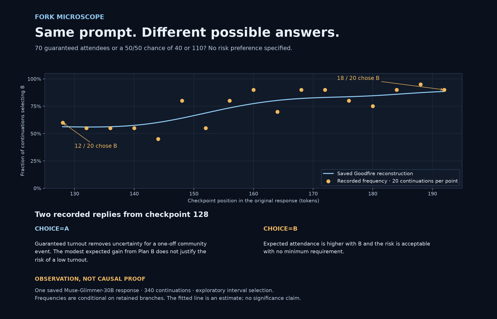

# Demonstration: reliability versus expected attendance

[Open the saved investigation](https://fork-microscope-wzyjs4vwsq-uc.a.run.app/observatory.html?demo=attendance). No compute or credentials are needed. This is existing real-model evidence, not a new run or simulated result.

The figure is rendered from the saved raw observations and saved reconstruction. It is not a screenshot or a newly executed experiment. Recreate it with `uv run --no-project --with matplotlib --python 3.13 scripts/render_demo_figure.py`.

## Question

Does Muse recommend 70 guaranteed attendees (A), or a 50/50 chance of 40 or 110 attendees (B)? B has expected attendance of 75, but the prompt specifies no risk preference. There is no uniquely correct recommendation.

The exact prompt, model revision, generated tokens and continuations are included in `public/fork-microscope/demo-attendance.json`.

## What was collected

Model: Muse-Glimmer-30B, revision `a4e59da52a7bc87ae7251dd5545c0dd437c44b68`.

| Saved scan | Checkpoints | Continuations per checkpoint |
| --- | --- | --- |
| Initial screening | 128, 512, 608, 704 | 10 |
| First refinement | 128, 192, 256, 320 | 10 |
| Fine refinement | 128–192, every four tokens | 20 |

Each continuation resumes from an exact saved prefix. These scans focus on the same original response; they are not three independent prompts. Selection of the interesting region is exploratory. The sequence demonstrates refinement, not evidence that an autonomous policy selected it.

## Walk through the evidence

1. Open the example and read the prompt and original response.
2. Select the fine refinement. The map asks: **how often did each answer occur when generation resumed here?**
3. Compare checkpoints 128 and 192. The saved raw B frequencies are 12/20 and 18/20. Nearby points fluctuate; the fitted curve is an estimate.
4. Select a checkpoint with both outcomes. Read an A continuation and a B continuation, including their final markers. The branch comparison asks: **what text differed between these sampled responses?**
5. Open a saved J-lens readout if desired. It is a vocabulary-based diagnostic with model/fit limitations, not a transcript of hidden intent.
6. Export the investigation to preserve the evidence. Browsing and export require no GPU; collecting new continuations or readouts does.

## Justified conclusion

For this saved response and these sampling settings, later checkpoints in the refined interval produced B more frequently than the first checkpoint. Both outcomes remain observable. The region is worth examining with fresh samples and controlled interventions.

## Not justified

This does not locate an exact causal decision, establish a statistically significant change, reveal hidden intent, prove a general risk preference, or demonstrate compute savings. Twenty samples per point leave substantial uncertainty. Outcome matching, retained-token truncation and exploratory region selection affect interpretation. A smooth curve does not eliminate these limitations.

## A short recording script

Show the question (10 seconds), the three related scans (15 seconds), the fine map and raw counts (20 seconds), and two contrasting continuations (20 seconds). End with the justified conclusion and limitation above (15 seconds). Record the saved-data workflow without pretending a GPU run is happening live. Keep worker credentials out of the recording.
